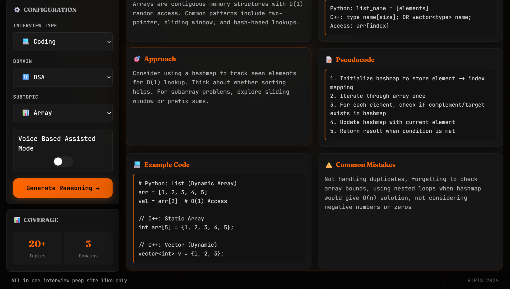

# RIPIS - Real-Time Interview Practice Intelligence System

RIPIS is a professional interview preparation platform designed to help students and developers master key concepts in **DSA**, **Operating Systems**, and **DBMS** through structured reasoning, code examples, and an immersive, voice-assisted terminal experience.


##  Key Features

-   **Structured Reasoning**: Get hints on Theory, Approach, Pseudocode, and Example Code for $20+$ topics.
-   **Voice Assisted Mode**: Immersive voice output and speech recognition to navigate and prepare hands-free.
-   **Comprehensive Domains**:
    -   **DSA**: Arrays, Linked Lists, Trees, Graphs, DP, and more.
    -   **OS**: Process Scheduling, Memory Management, Deadlocks.
    -   **DBMS**: SQL Queries, Normalization, ACID Properties.

## RIPIS Preview
 
##  Tech Stack

-   **Frontend**: React.js, Vite
-   **Backend**: Python, FastAPI, SQLite.
-   **UI/UX**: Custom Glassmorphism

---

##  Setup Instructions

### Prerequisites
- Python 3.8+
- Node.js 16+
- npm or yarn

### 1. Backend Setup
```bash
cd backend
python -m venv venv
# Windows
.\venv\Scripts\activate
# Linux/Mac
source venv/bin/activate

pip install -r requirements.txt
```

#### Environment Configuration

1. **Create the .env file**: 
   Copy the example file to create your own configuration:
   ```bash
   cp .env.example .env
   ```

2. **Configure Variables**: 
   Open the `.env` file and set the following values:

| Variable | Description | Required | Default |
| :--- | :--- | :--- | :--- |
| `OPENAI_API_KEY` | Your OpenAI API key for reasoning. | - | -

#### Start the Server
```bash
uvicorn app.main:app --reload
```
*Note: The backend will automatically initialize the SQLite database (`ripis.db`) on the first run. Please run the project on Chrome/Egde browser if willing to use voice assisted mode *

### 2. Frontend Setup
```bash
cd frontend
npm install
npm run dev
```

---

##  Project Structure
```text
├── backend/            # FastAPI Project
│   ├── app/            # Core logic, API, and Services
│   ├── requirements.txt
│   └── .env.example
├── frontend/           # React + Vite Project
│   ├── src/            # Components, Hooks, and Styles
│   ├── index.html
│   └── package.json
└── README.md
```
